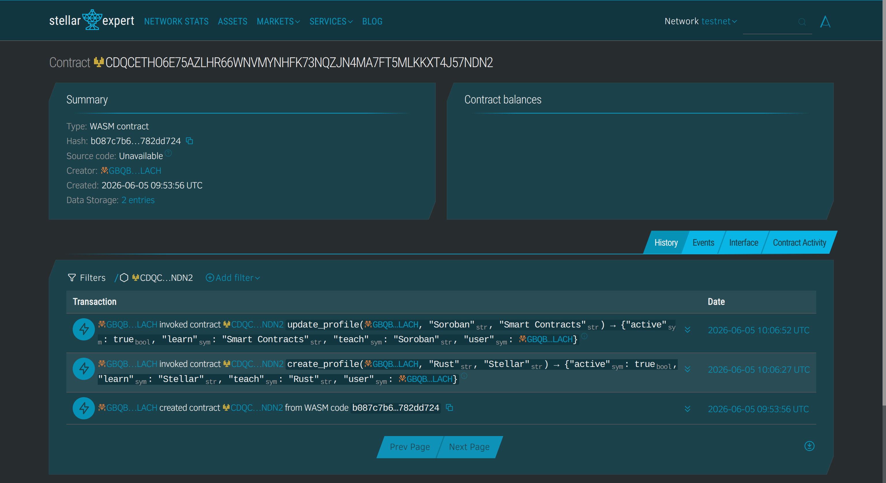

# SkillSwap

## Description

SkillSwap is a Stellar Soroban smart contract for creating simple on-chain skill exchange profiles.

The project allows a wallet to create a profile that stores one skill the user can teach and one skill the user wants to learn. The user can update the profile, check whether a profile exists, read the stored profile, and deactivate it when needed. I built this project as a practical alternative to basic hello-world or counter contracts. It demonstrates wallet authentication, persistent storage, and successful contract interaction on Stellar Testnet.

For example, a user can create a profile saying they can teach `"Rust"` and want to learn `"Stellar"`. Later, they can update it to teach `"Soroban"` and learn `"Smart Contracts"`.

## Project Vision

The vision of SkillSwap is to help people share learning interests and discover skill exchange opportunities through simple on-chain profiles. Instead of storing skill profiles only on a centralized platform, users can keep a small public record of what they can teach and what they want to learn.

In the long term, this idea can support learning communities, student clubs, workshops, and bootcamps. A frontend application could allow users to connect their wallet, create a skill profile, search for matching learners, and form peer-learning groups based on shared interests.

## Features

- Create a skill exchange profile for a wallet.
- Store the user's teach skill and learn skill using Soroban persistent storage.
- Update an existing profile.
- Query the current profile data.
- Check whether a wallet has an active profile.
- Deactivate a profile when needed.
- Require wallet authentication for write operations using `Address.require_auth()`.

## Contract

Network: Stellar Testnet

Contract ID:

```text
CDQCETHO6E75AZLHR66WNVMYNHFK73NQZJN4MA7FT5MLKKXT4J57NDN2
```

Contract link:

```text
https://stellar.expert/explorer/testnet/contract/CDQCETHO6E75AZLHR66WNVMYNHFK73NQZJN4MA7FT5MLKKXT4J57NDN2
```

Deploy transaction:

```text
https://stellar.expert/explorer/testnet/tx/0c5d5dea22e4581fc48f2f96c848c50160cc456421ff2a103ff5e0b8ac6c979d
```

Create profile transaction:

```text
https://stellar.expert/explorer/testnet/tx/1f4fcaa5414fa8007da171e195769c535d15797333a7f0fed70e178b052e56a1
```

Update profile transaction:

```text
https://stellar.expert/explorer/testnet/tx/5c2c64872707588974fac7254e3c4d61898b7c0ca058347d4b6b66825cbb85c3
```

Contract screenshot:



## Example Interaction

User account:

```text
GBQBEZVFHGBWJKNXWS372UA62RQPLKAUDPDDBS5Q7PKPASKFFJWBLACH
```

Create a profile:

```bash
stellar contract invoke --id CDQCETHO6E75AZLHR66WNVMYNHFK73NQZJN4MA7FT5MLKKXT4J57NDN2 --source-account charlie --network testnet -- create_profile --user GBQBEZVFHGBWJKNXWS372UA62RQPLKAUDPDDBS5Q7PKPASKFFJWBLACH --teach "Rust" --learn "Stellar"
```

Result:

```json
{"active":true,"learn":"Stellar","teach":"Rust","user":"GBQBEZVFHGBWJKNXWS372UA62RQPLKAUDPDDBS5Q7PKPASKFFJWBLACH"}
```

Check whether the profile exists:

```bash
stellar contract invoke --id CDQCETHO6E75AZLHR66WNVMYNHFK73NQZJN4MA7FT5MLKKXT4J57NDN2 --source-account charlie --network testnet -- has_profile --user GBQBEZVFHGBWJKNXWS372UA62RQPLKAUDPDDBS5Q7PKPASKFFJWBLACH
```

Result:

```text
true
```

Get the current profile:

```bash
stellar contract invoke --id CDQCETHO6E75AZLHR66WNVMYNHFK73NQZJN4MA7FT5MLKKXT4J57NDN2 --source-account charlie --network testnet -- get_profile --user GBQBEZVFHGBWJKNXWS372UA62RQPLKAUDPDDBS5Q7PKPASKFFJWBLACH
```

Result:

```json
{"active":true,"learn":"Stellar","teach":"Rust","user":"GBQBEZVFHGBWJKNXWS372UA62RQPLKAUDPDDBS5Q7PKPASKFFJWBLACH"}
```

Update the profile:

```bash
stellar contract invoke --id CDQCETHO6E75AZLHR66WNVMYNHFK73NQZJN4MA7FT5MLKKXT4J57NDN2 --source-account charlie --network testnet -- update_profile --user GBQBEZVFHGBWJKNXWS372UA62RQPLKAUDPDDBS5Q7PKPASKFFJWBLACH --teach "Soroban" --learn "Smart Contracts"
```

Result:

```json
{"active":true,"learn":"Smart Contracts","teach":"Soroban","user":"GBQBEZVFHGBWJKNXWS372UA62RQPLKAUDPDDBS5Q7PKPASKFFJWBLACH"}
```

Get the updated profile:

```bash
stellar contract invoke --id CDQCETHO6E75AZLHR66WNVMYNHFK73NQZJN4MA7FT5MLKKXT4J57NDN2 --source-account charlie --network testnet -- get_profile --user GBQBEZVFHGBWJKNXWS372UA62RQPLKAUDPDDBS5Q7PKPASKFFJWBLACH
```

Result:

```json
{"active":true,"learn":"Smart Contracts","teach":"Soroban","user":"GBQBEZVFHGBWJKNXWS372UA62RQPLKAUDPDDBS5Q7PKPASKFFJWBLACH"}
```

## Future Scopes

In the future, SkillSwap can be expanded into a more complete peer-learning platform. Possible improvements include supporting multiple skills per user, adding categories, matching users with complementary teach and learn skills, and allowing users to add short descriptions or contact information.

Another possible direction is to build a frontend application where users can connect their wallet, create their profile, browse active profiles, and find learning partners in a decentralized way.

## Profile

Name: Vo Lan Tuan

Skills:

- Rust smart contract development
- Stellar Soroban
- Blockchain basics
- Backend development
- AI and machine learning